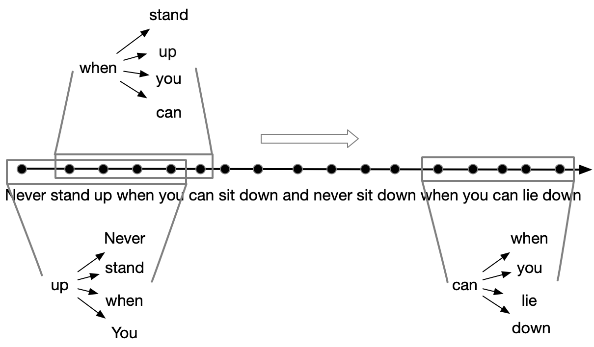
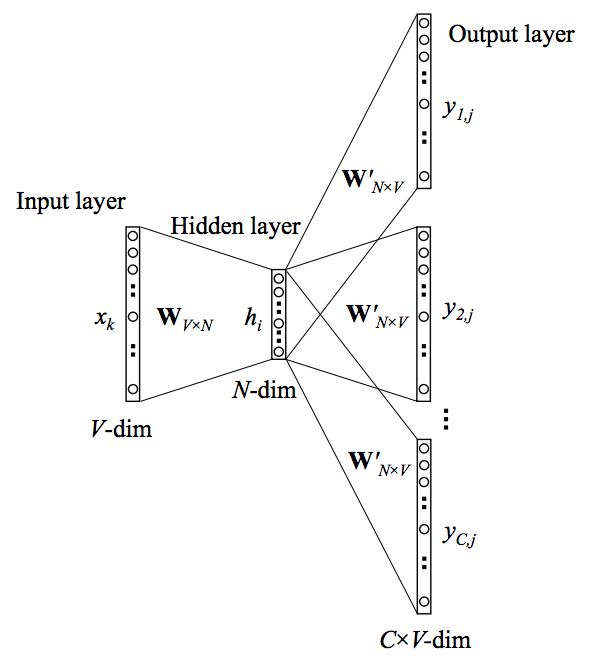
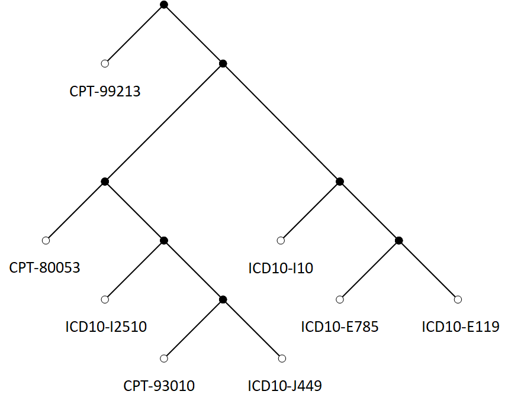
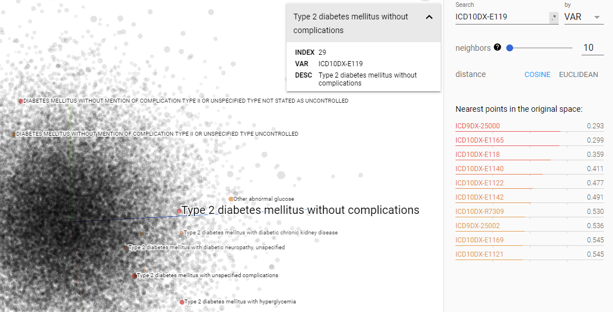
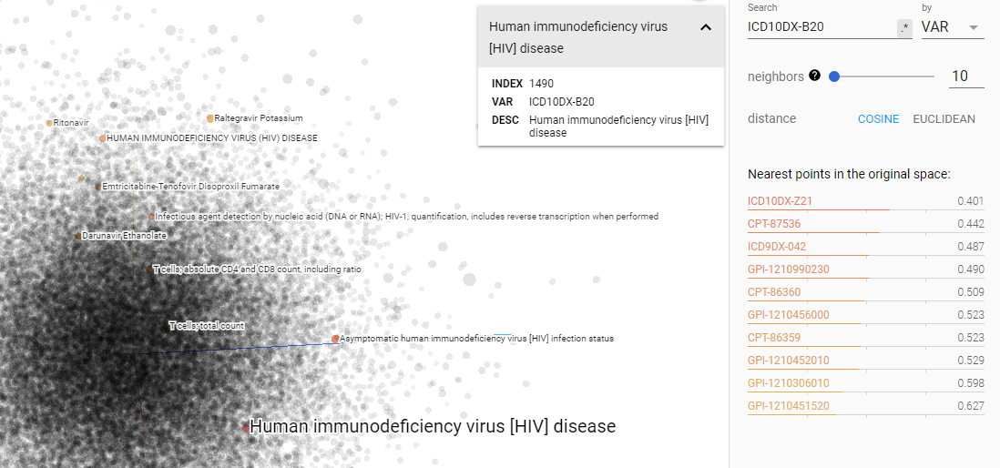

> Embedding is a dense representation of tokens in the form of numeric vectors. The concept derived from word embeddings which can be learned using a variety of language models. Such technique is well-known, but beyond NLP problems embedding can be implemented to represent other instances and entities. I'll briefly discuss such application through my experiences in healthcare industry.

The intuition embedding concept is to solve free-text data modeling, where the number of corpus is too large to represent documents as one-hot encoding in which each distinct word stands for one dimension of the resulting vector and a binary value indicates whether the word presents (1) or not (0). The problems is the vector of each token is too sparse and one-hot encoding assumes all tokens are independent while lots of tokens are semantically similar.

Similarly in healthcare data, we encounter problems of representing patient's healthcare records (such as electronic health records or medical claims) with one-hot encoding: e.g. a patient medical claim history is actually a long sequence of medical codes such as diagnosis ICD (International Classification of Diseases), procedure CPT (Current Procedural Terminology), medicine NDC (National Drug Code), lab results LOINC (Logical Observation Identifiers Names and Codes) and many other types. If the model aims to leverage all these claim codes for one patient, the unique size of claim code corpus is 100K+. From this perspective, such subject is quite similar to free-text.

This article will go through the principles of embedding techniques and some of my thoughts about it's application on other data beside text.

{: class="table-of-content"}
* TOC
{:toc}

## Skip-Gram Model

In NLP, Word2Vec model has already been widely applied, so I won't talk too much but briefly. Suppose you have a sliding window moving along a sentence, we take the central token as input, and its neighbors as target to train a skip-gram model ([Mikolov et al., 2013](https://arxiv.org/pdf/1301.3781.pdf)) predicting the probabilities of a word being a context word for the given target. Take the following sentence as an example demonstrating multiple pairs of input/output tokens as training samples, generated by a 5-word window sliding along the sentence.

> "Never stand up when you can sit down, and never sit down when you can lie down." -- Winston Churchill

 <i>Fig. 1. The skip-gram sampling technique.</i> 

Each context-target pair is treated as a new observation in the data. For example, the target word "when" in the above case produces four training samples: ("when", "stand"), ("when", "up"), ("when", "you"), and ("when", "can").

 <i>Fig. 2. The skip-gram model. Both the input vector $x$ and the output $y$ are one-hot encoded word representations. The hidden layer is the word embedding of size $N$.</i> 

Given the vocabulary size $V$, we are about to learn word embedding vectors of size $N$. The model learns to predict one context word (output) using one target word (input) at a time. 

According to Fig. 1, 

- Both input and output tokens are one-hot encoded into binary vectors $x$ and $y$ of size $V$.
- First, the multiplication of the binary vector $x$ and the embedding matrix $W$ of size $V \times N$ gives us the embedding vector of the input word $w_i$: the i-th row of the matrix $W$. 
- This newly discovered embedding vector of dimension $N$ forms the hidden layer.
- The multiplication of the hidden layer and the token context matrix $W’$ of size $N \times V$ produces the output one-hot encoded vector $y$. 
- The output context matrix $W’$ encodes the meanings of tokens as context, different from the embedding matrix $W$. NOTE: Despite the name, $W’$ is independent of $W$, not a transpose or inverse or whatsoever.

## Continuous Bag-of-Words (CBOW)

The Continuous Bag-of-Words (CBOW) is another similar model for learning word vectors. Only difference from Skip-Gram is that it predicts the target word from source context words.

Because there are multiple contextual words, we average their corresponding word vectors, constructed by the multiplication of the input vector and the matrix $W$. Because the averaging stage smooths over a lot of the distributional information, some people believe the CBOW model is better for small dataset.

## More than Words

In healthcare industry, medical concept learning would be a different story. Take medical claims for example, we can treat one patient's claim history as a "document", each encounter as "sentence" and each claim code as "word". However, unlike in free-text words within a sentence is ordered, one encounter is presented as a set of codes filed together within one service date. Clearly sliding window won't work here. As an analogy to Skip-Gram and CBOW assuming neighbor tokens are relevant to center tokens, my initial assumption in this scenario is all codes are relevant within an encounter, i.e. taking one token as input and all other codes as target. I call it "Claim2Vec". Taking one patient's claim records as example, for the patient ICD10-R269 (unspecified abnormalities of gait and mobility), ICD10-E119 (type 2 diabetes mellitus without complications), CPT-99213 (office visit) and CPT-1170F (functional status assessed) was documented in Nov 13th, 2017; ICD10-I110 (hypertensive heart disease with heart failure), ICD10-I509 (Heart failure, unspecified), NDC-5022845190 (Atorvastatin Calcium), NDC-6332328004 (Furosemide) was documented in Dev 2nd, 2017：

|  Target  |  Context |
| ------------ | ------------ |
| ICD10-R269 | ICD10-E119, CPT-99213, CPT-1170F | 
| ICD10-E119 | ICD10-R269, CPT-99213, CPT-1170F |
| CPT-99213 | ICD10-R269, ICD10-E119, CPT-1170F | 
| CPT-1170F | ICD10-R269, ICD10-E119, CPT-99213 |
| ICD10-I110 | ICD10-I509, NDC-5022845190, NDC-6332328004 |
| ICD10-I509 | ICD10-I110, NDC-5022845190, NDC-6332328004 |
| NDC-5022845190 | ICD10-I110, ICD10-I509, NDC-6332328004 |
| NDC-6332328004 | ICD10-I110, ICD10-I509, NDC-5022845190 |

The approach might seems arbitrary, but we cannot copy Skip-Gram to this case as we cannot pre-assume the order of claim codes within encounters: diagnosis might happens before or after procedure or medicines.

## Loss Functions

All above models should be trained to minimize a well-designed loss/objective function. There are several loss functions we can incorporate to train these language models. Given an input word $w_I$, let us label the corresponding row of $W$ as vector $v_{w_I}$ (embedding vector) and its corresponding column of $W'$ as $v'_{w_I}$ (context vector). The final output layer applies softmax to compute the probability of predicting the output word $w_O$ given $w_I$, and therefore:

$$
p(w_O \vert w_I) = \frac{\exp({v'_{w_O}}^{\top} v_{w_I})}{\sum_{i=1}^V \exp({v'_{w_i}}^{\top} v_{w_I})}
$$

This is accurate as presented in Fig. 1. However, when $V$ is extremely large, calculating the denominator by going through all the words for every single sample is computationally impractical. The demand for more efficient conditional probability estimation leads to the new methods like *hierarchical softmax*.

### Hierarchical Softmax

Morin and Bengio ([2005](https://www.iro.umontreal.ca/~lisa/pointeurs/hierarchical-nnlm-aistats05.pdf)) proposed hierarchical softmax to make the sum calculation faster with the help of a binary tree structure. The hierarchical softmax encodes the language model's output softmax layer into a tree hierarchy, where each leaf is one token and each internal node stands for relative probabilities of the children nodes. Mikolov et al. ([2013](https://arxiv.org/pdf/1301.3781.pdf)) further improve the structure into [Huffman tree](https://en.wikipedia.org/wiki/Huffman_coding) which minimizes the expected path length from root to leaf, thereby minimizing the expected number of parameter updates per training task. Here's an example showing how it works:

Let's say the whole token population contains 8 claim codes, and the frequency of each token are as follows:

|  Token  |  Counts |
| ------------ | ------------ |
| CPT-99213 (Office or other outpatient visit) | 14 |
| ICD10-I10 (Essential hypertension) | 7 |
| CPT-80053 (Comprehensive metabolic panel) | 4 |
| ICD10-E119 (Type 2 diabetes mellitus without complications) | 3 |
| ICD10-E785 (Hyperlipidemia) | 3 |
| ICD10-I2510 (Atherosclerotic heart disease) | 2 |
| ICD10-J449 (Chronic obstructive pulmonary disease) | 2 |
| CPT-93010 (Electrocardiogram) | 1 |

According to Huffman coding, we can convert this table into a Huffman tree:

 <i>Fig. 3. An illustration of the hierarchical softmax Huffman tree. The leaf nodes in white are tokens in the corpus. The black inner nodes carry information on the probabilities of reaching its child nodes. One path starting from the root to the leaf denotes the way to get probability on this token.)</i> 

Now view this tree as a decision process, or a random walk, that begins at the root of the tree and descents towards the leaf nodes at each step. It turns out that the probability of each outcome in the original distribution uniquely determines the transition probabilities of this random walk. At every internal node of the tree, the transition probabilities to the children are given by the proportions of total probability mass in the subtree of its left- vs its right- child. This decision tree now allows us to view each outcome (i.e. tokens in the corpus) as the result of a sequence of binary decisions. For example:

$$
P(\text{ICD10-I10}|w_I) = P_{n0}(\text{right}|w_I) \times P_{n1}(\text{right}|w_I) \times P_{n2}(\text{left}|w_I)
$$

There are only two outcomes, of course, so:

$$
P(\text{right}|w_I) = 1 - P(\text{left}|w_I)
$$

These distributions are then modelled using the logistic sigmoid $\sigma$:

$$
P(\text{left}|w_I) = \sigma({\gamma_n}^{\top} \alpha_{w_I})
$$

where for each internal node n of the tree, $\gamma_n$ is a coefficient vector as the new parameter. The wonderful thing about this new parameterization is that the probability of a single outcome $P(w_O \vert w_I)$ only depends upon the $\gamma_n$ of the internal nodes $n$ that lie on the path from the root to the leaf labelling $w$. Thus, if in the case of a balanced tree, the number of parameters is only logarithmic in the size $\vert W \vert$ of the vocabulary, which significantly reduces the algorithm complexity from $O(V)$ of softmax to $O(\log_2 V)$.

Here comes the question of why using Huffman tree instead of a random assigned balanced binary tree. The reason is Huffman tree encodes based on token frequency, so as Figure 3. illustrated, more frequent tokens are more close to the root, which in general shorten the path of tokens overall and speed up the process.

### Noise Contrastive Estimation (NCE)

The Noise Contrastive Estimation (NCE) metric intends to differentiate the target word from noise samples using a logistic regression classifier ([Gutmann and Hyvärinen, 2010](http://proceedings.mlr.press/v9/gutmann10a/gutmann10a.pdf)). The intuitive of NCE is converting multi-class classifier to a binary classifier: feeding a true pair and $k$ random corrupted pair.

Given an input token $w_I$, the correct output word is known as $w$. We call $P(w \vert w_I)$ and $P(w_I)$ as prior distribution. NCE sample one token $w_I$ from distribution $P(w_I)$, and sample one token $w$ from distribution $P(w \vert w_I)$, the combination of $w_I$ and $w$ can be treated as a positive pair. In the meantime, we sample $k$ other words from the noise sample distribution $Q(\tilde{w})$, denoted as $\tilde{w}_1
, \tilde{w}_2, \dots, \tilde{w}_k \sim Q(\tilde{w})$. Let's label the decision of the binary classifier as $d$ and $d$ can only take a binary value. The joint distribution of $(d, w)$ is:

$$
P(d,w \vert w_I) = \frac{k}{1+k} \times Q(\tilde{w}) \text{ if } d = 0 \\
P(d,w \vert w_I) = \frac{1}{1+k} \times P(w \vert w_I) \text{ if } d = 1
$$

Based on Bayesian rule, the formula can be converted into:

$$
P(d = 0 \vert w_I, w) = \frac{ \frac{k}{1+k} \times Q(\tilde{w}) }{ \frac{1}{1+k} \times P(w \vert w_I) + \frac{k}{1+k} \times Q(\tilde{w}) } = \frac{ k \times Q(\tilde{w}) }{ P(w \vert w_I) + k \times Q(\tilde{w}) } \\
P(d = 1 \vert w_I, w) = \frac{ P(w \vert w_I) }{ P(w \vert w_I) + k \times Q(\tilde{w}) }
$$

Here if note model parameters as $\theta$, NCE use model distribution $P_\theta(w \vert w_I)$ to replace prior distribution $P(w \vert w_I)$. Then we can represent loss function $\mathcal{L}_\theta$ as

$$
\begin{align}
\mathcal{L}_\theta
&= - [ \log P(d=1 \vert w, w_I) + \sum_{\substack{i=1}}^k \log p(d=0|\tilde{w}_i, w_I) ]\text{ , } \tilde{w}_i \sim Q(\tilde{w}) \\
&= - [ \log \frac{ P(w \vert w_I) }{ P(w \vert w_I) + k \times Q(\tilde{w}) } +  \sum_{\substack{i=1}}^N \log \frac{ k \times Q(\tilde{w}) }{ P(w \vert w_I) + k \times Q(\tilde{w}) }]\text{ , } \tilde{w}_i \sim Q(\tilde{w})
\end{align}
$$

However, $P(w \vert w_I)$ still involves summing up the entire corpus in the denominator. Let’s label the denominator as a partition function of the input word, $Z(w_I)$. A common assumption is $Z(w) \approx 1$ given that we expect the softmax output layer to be normalized ([Minh and Teh, 2012](https://www.cs.toronto.edu/~amnih/papers/ncelm.pdf)). Then the loss function is simplified to:

$$
\mathcal{L}_\theta = - [ \log \frac{\exp({v'_w}^{\top}{v_{w_I}})}{\exp({v'_w}^{\top}{v_{w_I}}) + k \times Q(\tilde{w})} +  \sum_{\substack{i=1}}^N \log \frac{k \times Q(\tilde{w})}{\exp({v'_w}^{\top}{v_{w_I}}) + k \times Q(\tilde{w})}]\text{ , } \tilde{w}_i \sim Q(\tilde{w})
$$

The noise distribution $Q(\tilde{w})$ is a tunable parameter and we would like to design it in a way so that:
- intuitively it should be very similar to the real data distribution; and
- it should be easy to sample from. 

For example, the sampling implementation of NCE loss in TensorFlow assumes that such noise samples follow a log-uniform distribution. The probability of a given word in logarithm is expected to be reversely proportional to its rank, while high-frequency tokens are assigned with lower ranks.

### Negative Sampling (NEG)

The Negative Sampling (NEG) proposed by Mikolov et al. ([2013](https://papers.nips.cc/paper/5021-distributed-representations-of-words-and-phrases-and-their-compositionality.pdf)) is a simplified variation of NCE loss. Different from NCE Loss which attempts to approximately maximize the log probability of the softmax output, negative sampling did further simplification, which approximates the binary classifier's output with sigmoid functions as follows:

$$
\begin{align}
P(d=1 \vert w_, w_I) &= \sigma({v'_{w}}^\top v_{w_I}) \\
P(d=0 \vert w, w_I) &= 1 - \sigma({v'_{w}}^\top v_{w_I}) = \sigma(-{v'_{w}}^\top v_{w_I})
\end{align}
$$

The final NCE loss function looks like:

$$
\mathcal{L}_\theta = - [ \log \sigma({v'_{w}}^\top v_{w_I}) +  \sum_{\substack{i=1}}^N \log \sigma(-{v'_{\tilde{w}_i}}^\top v_{w_I})]\text{ , } \tilde{w}_i \sim Q(\tilde{w})
$$

## Other Tips for Learning Embedding Beyond Words

- **Subsampling frequent tokens**: extremely frequent tokens might be too general to differentiate the context; for example in NLP, stop words like "the", "a"; and in claim codes CPT codes like "office visit", "hospital visit" or "independent laboratory". While on the other hand, rare tokens are more likely to carry distinct information, such as severe rare conditions or effective prescription medicines. To balance the frequent and rare words, Mikolov et al. proposed to discard tokens $w$ with probability $1-\sqrt{t/f(w)}$ during sampling, where $f(w)$ is the word frequency and $t$ is an adjustable threshold.

- **Learning phrases first**: phrases often stand as conceptual units, rather than simple compositions of individual tokens. For example in NLP "machine learning" stands for entirely different meaning compared to "machine" or "learning". Learning such phrases first and treating them as word units before training the word embedding model improves the outcome quality. We can simply scan the vocabulary with certain frequency cutoff values with bi-grams and tri-grams. However, such impact might not effective in other use case. In claim codes data, codings are rather independent, ordering does not exists so n-grams cannot perform, and the medical representation of combination of tokens normally won't give add-on information compared to individuals.

## More than 2Vec

Since 2017, ELMo ([Peters et al.](https://arxiv.org/abs/1802.05365)), BERT ([Devlin et al.](https://arxiv.org/abs/1810.04805)) and XLnet ([Yang et al.](https://arxiv.org/abs/1906.08237)) were being created which pushed NLP into a new level (funny why folks name them after Sesame Street). If interested, please visit [Jay Alammar's blog](http://jalammar.github.io/illustrated-bert/) giving an outstanding illustration of such models. One of the intuitive of these models is context issue. While Word2Vec gives each word a fixed vector representation no matter what the context is, these models tend to produce dynamic, contextualized embeddings. For example, the word "Apple" can be both a fruit or a company depending on context. In an ideal Word2Vec, if you highlight hyper-dimensional points of all the fruit words and all the company words, "Apple" might appear right between the two groups. But contextualized embedding models would give "Apple" totally different vectors based on what context looks like. Take ELMo as example, in simple words it's a model based on GloVe embeddings followed by multi-layer bidirectional LSTM trained in English-German task. The secret of ELMo to produce contextualized embeddings is to concatenate hidden state vectors in bi-LSTM layers.

 <i>Fig. 4. A structure of EMLo, [image source](https://ireneli.eu/2018/12/17/elmo-in-practice/).</i> 

Big question is, should such issue be concerned in other embedding use cases other than NLP? In claim codes data, the medical meaning of each coding is generally fixed. But what if certain medicine can treat multiple conditions, or certain medicine perform differently under various conditions, or even some virus infection might be minor but can be very serious if the patient is carrying HIV? Please let me know your thoughts on this.

## Examples: Claim2Vec

After reviewing all the theoretical knowledge above, let me show you an trained example medical concept embedding based on millions of patient claim records. Using Google's [projector tool](https://projector.tensorflow.org/), all trained claim embeddings are plotted with PCA into 3-D visualization. If we search code ICD10-E119 (Type 2 diabetes mellitus without complications):

 <i>Fig. 5. Claim2Vec Demo I.</i> 

Note that in the original space, the nearest claim codes are basically all about diabetes. Let's try something scarier, ICD10-B20 (HIV disease):

 <i>Fig. 5. Claim2Vec Demo II.</i> 

In the original space, the nearest claim codes includes asymptomatic HIV infection status, 	infectious agent detection by nucleic acid (DNA or RNA) of HIV-1 quantification, a medicine code of Emtricitabine-Tenofovir Disoproxil Fumarate (treat HIV infection and reduce the risk of HIV infection) and also T-Cell counts. Such codes are all medically relevant.

Hope this post helps explain stuffs!