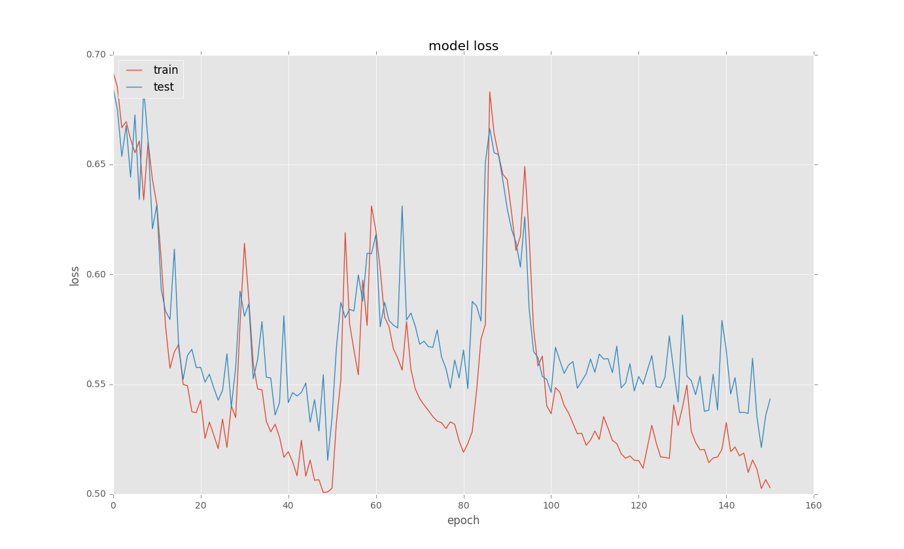
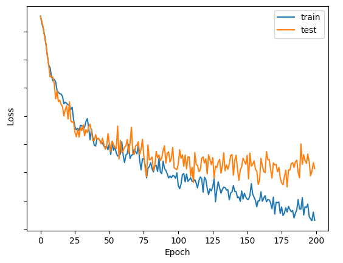
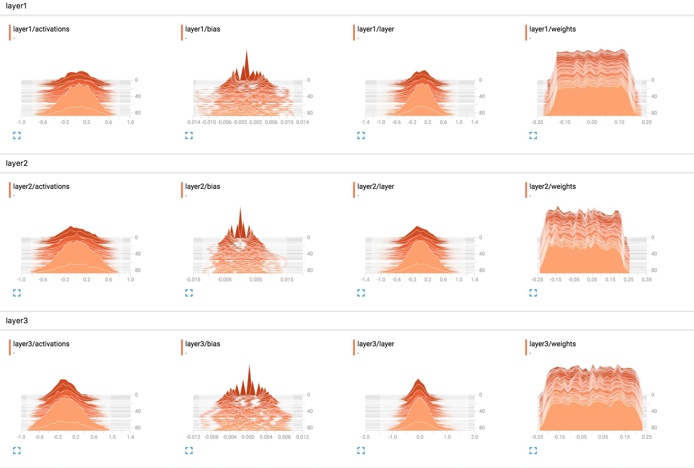

> While deep learning models have been proved to be powerful to apply in industrial applications, they certainly cost us a lot more time to make them right compared to developing machine learning pipelines, especially when the data is a lot and complex, or model scale is large, we often encounter issue of underfitting or loss not converging. The article will talk a little bit my experience of how to solve such problem.


{: class="table-of-content"}
* TOC
{:toc}

## Diagnose the Issue

What is converging? Some folks define converging as training set loss value eventually being lower than ```10e-06```. I'll say there's no exact definition, but we do know after several epochs' training training loss does not significantly decrease, there gotta be something wrong. Here also it brought up another discussion of overfitting vs underfitting. Here we're talking about underfitting that the model cannot fit the dataset well, and the symptom would be both training loss and validation loss fluctuate a lot since the beginning of the training and nearly don't drop during training:

<div style="text-align: center"></div>

<center> <i>Fig. 1. An underfitting example.</i> </center>

Overfitting on the other hand is model fit to the training set too much to generalize such good performance to data outside training set. The symptom of overfitting is both training loss and validation loss decrease at begining but after a certain timestamp, validation loss stop decrease (even begin increase) while training loss continue to drop to eventually near 0:

<div style="text-align: center"></div>

<center> <i>Fig. 2. An overfitting example.</i> </center>

Back to topic, if the model not learning, what might happen and how to solve things? In general the cause of loss not converging is either dataset issue or network issue.


## Something Wrong with the Dataset

In many projects, data is a bigger issue compared to network design, if the data is not right, network tweaks only helps a little. While deep learning models is powerful to fit large amount of data, it requires a lot more strict jobs to take care of before feed into models compared to machine learning. There are some common issues about dataset.

### Bad Data Quality

Sometimes the dataset just won't work, and this is totally an open issue for everybody. It's possible the quality of the dataset is really bad. Let me give you a story from my experience: I used to try working on patient outcome risk predictions based on electronic health records (EHR) in early 2018. EHR has been generally treated as big step forward in healthcare industry due to it's clear, structured and standardized presenting of patient medical data compared to traditional paper-based medical records. But at the beginning stage of EHR development, there is still no single industrial standards to unify EHR formats from all vendors. By the time I was still collecting EHRs under Clinical Document Architecture (CDA) published by [HL7](http://www.hl7.org/implement/standards/product_brief.cfm?product_id=7). Even under CDA structure, in reality EHR vendors use different template IDs to identify section details, some even using independent coding systems (e.g. Cigna sometimes use their own codes at lab results), it was painful to migrate all data. After spending months to prepare preprocessing, I noticed there's a lot more issues such as some doctors just being lazy that put all info into free text area instead of filling EHR sub-sections. In the end I embedded all codes and concatenate numeric values as the model input, the training loss fluctuated a lot and eventually the model produce 0.57 AUROC.

It's also possible that the project is not doable. We have to face it, there will be a lot failed projects in our careers. When we try to achieve an prediction goal, the data available in our hands just provide little contributions from feature space, no matter how magic deep learning is, the model just simply won't fit the dataset.

### Too Large Data Size

People always say deep learning models are greedy about data amount - the more the better. But sometimes large data size might hurt the learning process of models. The reason is large data size tend to jeopardize the randomness of gradient decent. Theoretically, as long as the network has no problems, loss will always converge on the dataset small enough. On the other hand, if the dataset is too large, the network will not be scalable to fit the entire sample space, while small data set generally only produce overfitting problems. Possible ways to solve it are try small sample size first and observe the loss descending, or try to reduce the feature size (e.g. use smaller embedding size).

### Data is not Normalized Properly

Most of the data structures are complex. Taking the EHR example from above, in the lab section of one EHR document, multiple labs are taken to produce various results: complete blood count (CBC)  measures the types and numbers of cells in the blood (unit as count), prothrombin time measures how long it takes blood to clot (unit as time), while helicobacter pylori test produce a binary value of positive or negative. These numbers cannot simply be taken and dump into models.

From the perspective of input, if the all the data fits in a continuous space, it can be easily controls them in a consistent distribution. But like the EHR example, there are various discontinuities and references in the data space making the learning task very difficult. You have to consider all the possible discontinuities all sources of data, and find the universal normalization method to keep all numerics data in the same place. Generally we normalize all data to follow normal distribution, e.g. in the EHR case, I created individual [normalizers](https://scikit-learn.org/stable/auto_examples/preprocessing/plot_all_scaling.html#standardscaler) for each lab type with numeric results. It might sounds like an annoying job, but it's necessary.

## Something wrong with the network

If you have very good data quality in your hands and you have preprocessed data properly but the model still won't converge, there must be something wrong with the network design.

### Regularization Blinding Your Sight

There are several regularization approaches being well-known and effective to prevent overfitting, especially Dropout. Other example are L2 regularization, L1 regularization or adding noises. But sometimes we apply them directly on networks at beginnings, which potentially limits the learning ability of the network. I used to train a model with Dropout initially assigned as 0.5 on everything Transformer fully connected layer, and no matter how I changed hyper-parameters, the training loss just dropped 0.2 from initial loss no more. Once I removed the Dropout completely, the training loss dropped to 0 in a few epochs. Although the model was overfitting, at least I got the chance to re-implement regularization carefully with different Dropout rate.

### Wrong Learning Rate

Learning rate can be one of the most important hyper-parameters to tune for deep network works. It is vital important for us to find the optimal learning rate for networks. Wrong learning rate can lead to many potential problems. For example, if you noticed your training loss decreases for a little while and suddenly increases to a large number, such spike might indicate large learning rate in a network with softmax final layer. Large learning rate might lead to a certain node over-activated: e.g. if one of the final layer "logits" is 100, in softmax ```exp(100) = Inf``` leads to weights become ```NAN``` after back-propagation. After this moment, the weights will be remain as ```NAN``` and the loss will suddenly increase.

Choosing right learning rate also matters depending on which optimizer you use. There are multiple optimizers in deep neural networks, among which stochastic gradient descent (SGD) is the most well-known one. SGD is very good at fast dropping loss in the minima under a proper learning rate right before the model converges. But SGD can be tricky if your learning rate is not right. Other than that, Adadelta and Adam are much more sophisticated optimizer than SGD which helps you decay your pre-defined max learning rate to reach the best step at each training batch. Such optimizers relief you from stress of tunning learning rate at beginning, but they are a lot more expensive to compute and the effectiveness is not significant right before the loss finally converges. You might try design your network using Adams at first and switch to SGD at the last a few epochs.

One more thing to notice is gradient clipping, which is widely popular in modern deep learning frameworks. Gradient clipping might help you prevent gradient explosion: it forces weights to change at each step, which is very helpful in a dataset with too mange outliers. However, with this feature it would make it very difficult for us finding the optimal learning rate: in a lot of cases, users set the learning rate too high due to gradient clipping leading to model learning slowly and unstable behavior. Here we suggest shutdown gradient clipping at beginning, and once you find the highest learning rate that won't make mistakes, lower it a little which makes it very close to the optimal learning rate. In my experience, optimal learning rate can be between 0.0001 to 0.1 depending your network designs.

### Wrong Activation Functions
 
In general the choices of activation functions is not random but mostly based on experience. For example, in convolutional neural networks, the output of convolutional layer should be activated by ReLu; in recurrent neural networks recurrent layer ($ \tilde{C} = \tanh(W_c x_t + U_c h_{c-1} + b_c) $) always use tanh activation while the input/forget/output gates should use sigmoid as activation (obviously gates means 0-1). Generally fully connected layers also use ReLu to activate. In the output layer, softmax is the classic choice for classification problems, while in regression problems, you have to be very careful to use any activation function.

My suggestion is, when you trying to implement deep neural networks, carefully read the original pager or thoroughly go through source code, where the author(s) usually points out which activation functions are the best ones for the model. They are always right!

### Corrupted Gradients

It's very hard to diagnose just from training/validation loss plots. It is possible during the training process some gradients already corrupted. One example would be weights turn to ```NAN``` if the learning rate is too large.

Other examples can be ReLu activation function might lead to dead gradients which further prevent model from learning. Since the gradient of ReLu is 1 when input is positive while 0 if input is negative. When a lot of inputs are negative, the subtle changes of the inputs won't affect outputs shortly, but when multiple layers stacked together, it is possible that the weights of other layers might turn from large gradient positive values into 0 gradient negative values. Once the situation happens, most of the gradient would turn into 0 preventing model from learning. You might try replace ReLu with [leaky ReLu](https://ml-cheatsheet.readthedocs.io/en/latest/activation_functions.html#leakyrelu) or [ELU](https://ml-cheatsheet.readthedocs.io/en/latest/activation_functions.html#elu) see if that works.

Here I might suggest gradient check when you encounter such problems. TensorBoard provides great tools to plot the distribution of gradients at all weights during the training:

```python
optimizer = tf.train.AdamOptimizer()
gradients = optimizer.compute_gradients(loss=some_loss)

for gradient, variable in gradients:
    tf.summary.histogram("gradients/" + variable.name, gradient)
    tf.summary.histogram("variables/" + variable.name, variable)
train_op = optimizer.apply_gradients(gradients)
 
with tf.Session() as sess:
    summaries_op = tf.summary.merge_all()
    summary_writer = tf.summary.FileWriter("/tmp/tb", sess.graph)
    for step in itertools.count():
        _, summary = sess.run([train_op, summaries_op], feed_dict={x=x, y=y})
        summary_writer.add_summary(summary, step)
```

<div style="text-align: center"></div>

<center> <i>Fig. 3. TensorBoard Gradient Check example.</i> </center>

Such tools is great for you to diagnose your networks thoroughly but we have to use it right. The most important one is before the gradient check you have to remove [batch normalization](https://en.wikipedia.org/wiki/Batch_normalization) first! The reason is that while batch normalization helps model to control gradient descent in a stable pace and keep all weights the same distribution, it covers the problem of corrupted gradients even if there are already somethings wrong in the network.

### Wrong Weight Initialization

If you are not properly using the right strategy of initialization, the network won't work. There are so many initialization approaches, but if categorize them generally, there are 3 strategies: uniform distribution, normal distribution and fix values.

Similar to choosing tight activation functions, original papers usually helps you select the optimal initialization strategies already. For example, all-zeros initialization is usually used in shallow layer logistic regression networks. The most common initialization might be [glorot_uniform](https://www.tensorflow.org/versions/r1.14/api_docs/python/tf/glorot_uniform_initializer), which is a uniform distribution with mean as 0. However it might cause gradient vanishing in some network designs. Some special models use unique strategies, like Word2Vec model use [random_uniform](https://www.tensorflow.org/versions/r1.14/api_docs/python/tf/random_normal_initializer) as initialization of embeddings while use [truncated_normal](https://www.tensorflow.org/versions/r1.14/api_docs/python/tf/initializers/truncated_normal) with standard deviation of $1/\sqrt{D_e}$ to initialize NCE weights. If common initialization approaches do not work on your network, a lazy way to fix it is trying [he_normal](https://www.tensorflow.org/versions/r1.14/api_docs/python/tf/initializers/he_normal) or [lecun_normal](https://www.tensorflow.org/versions/r1.14/api_docs/python/tf/initializers/lecun_normal) which almost well under conditions. Sometimes initialization can be magical: if you use it right, you won't even spend much time on hyper-parameter tuning; if not, entire model might be corrupted.

Hope this post helps explain stuffs!