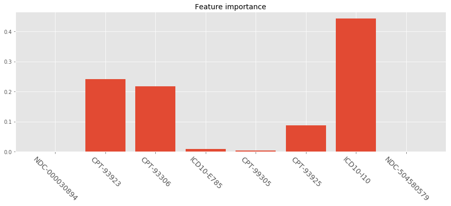
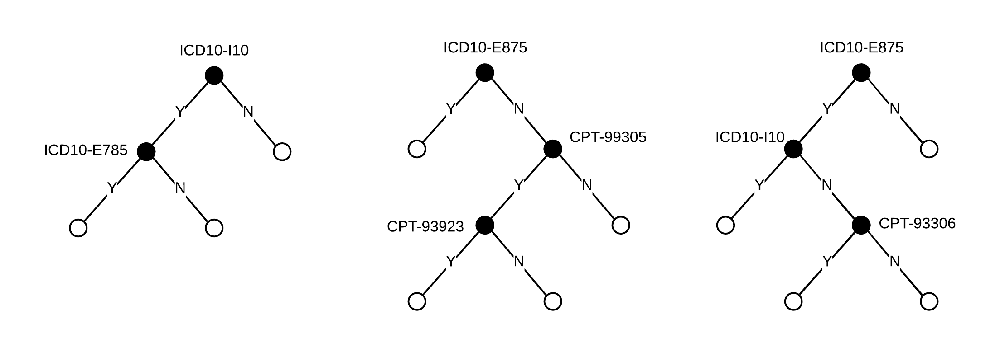

> With the birth of XGBoost, addictive tree models have been widely applied in industries (such as LightGBM, CatBoost) due to their state-of-the-art performance and well-engineered parallel acceleration computing. However the one general rule in machine learning field is more complex models that fit well to data are less interpretable. This article will talk about different approaches that let a model "speaks" and explains how the model generate outputs.


{: class="table-of-content"}
* TOC
{:toc}


Interpretability of machine learning is vital important in any business applications, which is one of the biggest challenge of machine learning product selling. Most data scientists or machine learning engineers often do not focus on buying user trust by explaining reasoning behind a decision in an easy-to-digest way, but spend most of the time trying to boost model performance. I've encountered situations so many times that I presented some cool stuffs with confidence to leaderships how magic they are and how much money they're gonna save for the company, but I was followed by questions like "man this is great, but how does it come to such conclusions". It's tough, especially when trying to explain models to non-technical folks who are usually the guys deciding whether to apply your models. When you are trying to train cutting-edge algorithms, it equally increase the difficulty of model interpretation, because it is their decision-making complexity that fit the data better.


[XGBoost](https://xgboost.readthedocs.io/en/latest/index.html) (as well as faster version [LightGBM](https://lightgbm.readthedocs.io/en/latest/) by Microsoft) might be many companies' favorite algorithm. The performance usually the most robust and outstanding compared to traditional models, and they are easy to train and deploy in multiple environment. Let's break down some details about approaches to interpret these addictive tree models.


## Start with an Example

Let's start with an simple example. We have couple of patients' claim data from last year and we want to prospective find out whether they will potentially have vascular disease next year. The dataset is rather straightforward: we have 8 claim codes as variables which are all binary values indicating each patient filed that claim last year. All of these codes are not directly indicating vascular disease in Medicare population based on [CMS' 2019 rules](https://www.cms.gov/Medicare/Health-Plans/MedicareAdvtgSpecRateStats/Risk-Adjustors-Items/RiskModel2019.html), in this way we actually machine learning meaning to detect those who might have potential gaps of vascular disease. And we have one column of binary labels indicating the fact whether patients were diagnosed as vascular disease last year. The 8 variables are:


|  Variable  |  Description |
| ------------ | ------------ |
| NDC-000030894 | Eliquis Apixaban (treat and prevent blood clots and to prevent stroke) | 
| CPT-93923 | Under Non-Invasive Extremity Arterial Studies, upper and lower |
| CPT-93306 | Under Echocardiography Procedures | 
| ICD10-E785 | Hyperlipidemia, unspecified |
| ICD10-I110 | Initial Nursing Facility Care, per day |
| CPT-93925 | Under Non-Invasive Extremity Arterial Studies, lower |
| ICD10-I10 | Essential (Primary) Hypertension |
| NDC-504580579 | Rivaroxaban, (blood thinners treating and preventing blood clots) |


Taking XGBoost as example, a simple model is built under Python 3.7 with XGBoost version as [0.90](https://xgboost.readthedocs.io/en/release_0.90/python/python_api.html#module-xgboost.sklearn). Let's build the model and plot XGBoost's native feature importance:

```python
import xgboost as xgb
import pandas as pd
import matplotlib.pyplot as plt

# read dataset
data = pd.read_csv('vd_example.csv', header=0)
columns = data.columns
print(columns)

# shuffle dataset
data = data.sample(frac=1).reset_index(drop=True)

# train xgboost model
param = {
    "learning_rate": 0.1,
    "n_estimators ": 500,
    "max_depth": 7,
    "min_child_weight": 1,
    "gamma": 0,
    "importance_type": "gain",
    "n_jobs": -1,
}
model = xgb.XGBClassifier(**param).fit(data[columns[:-1]], data['Vascular_Disease'].values)

# plot feature importance
with plt.style.context("ggplot"):
    plt.figure(figsize=(15, 5))
    plt.bar(range(len(columns[:-1])), model.feature_importances_)
    plt.xticks(range(len(columns[:-1])), columns[:-1], rotation=-45, fontsize=14)
    plt.title('Feature importance', fontsize=14)
    plt.show()
```
<br>
<div style="text-align: center"></div>

<center> <i>Fig. 1. Feature importance in XGBClassifier</i> </center>


Is this plot telling the story? Can we say essential hypertension is the largest contributor to the output? Noticed that in the parameter set I added ```importance_type``` as ```"gain"```, there are also options of ```"weight"``` and ```"cover"```. What does that means? Let's break down.


## Weight (Frequency)

Addictive tree models are massive ensemble of multiple weak learners, which in general are [CARTs (Classification And Regression Trees)](https://en.wikipedia.org/wiki/Decision_tree_learning). The weight (or frequency) measure of XGBoost is the percentage representing the numbers of times each feature occurs in the trees of the model or number of times each feature used for split. In the our example, let's assume the model only contains 3 trees as followed:

<div style="text-align: center"></div>

<center> <i>Fig. 2. Sample XGBoost Trees</i> </center>

The weight approach count the total splits for each feature: e.g. ICD10-I10 occurred in 1 split and 1 split in each of tree1 and tree3; then we the weight for ICD10-I10 will be 2. The frequency for ICD10-I10 is calculated as its percentage weight over weights of all features. In this 3-tree example, weights are ICD10-E785: 3 (0.375), ICD10-I10: 2 (0.25), CPT-93923: 1 (0.125), CPT-99305: 1 (0.125) and CPT-99306: 1 (0.125), while all other features got weights of 0.


The downside of weight approach is, the features that get more splits are not necessarily contribute more to the output. Common features might be used for splitting trees a lot, but those splits might not distinguish targets significantly. Another issue with weight approach is not stable from model to model under the same dataset: if you train 2 models on exactly the same dataset, the tree structures are totally different which affects split counts.


## Cover

The cover metric means the relative number of observations related to this feature. For example, if you have 100 observations, 4 features and 3 trees, and suppose feature1 is used to decide the leaf node for 10, 5, and 2 observations in tree1, tree2 and tree3 respectively; then the metric will count cover for this feature as 10+5+2 = 17 observations. This will be calculated for all the 4 features and the cover will be 17 expressed as a percentage for all features' cover metrics.


Hope this post helps explain stuffs!