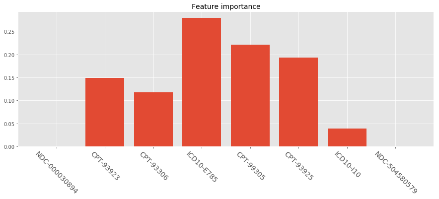
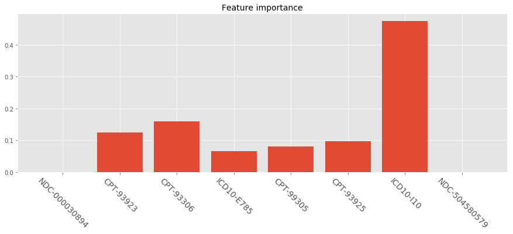
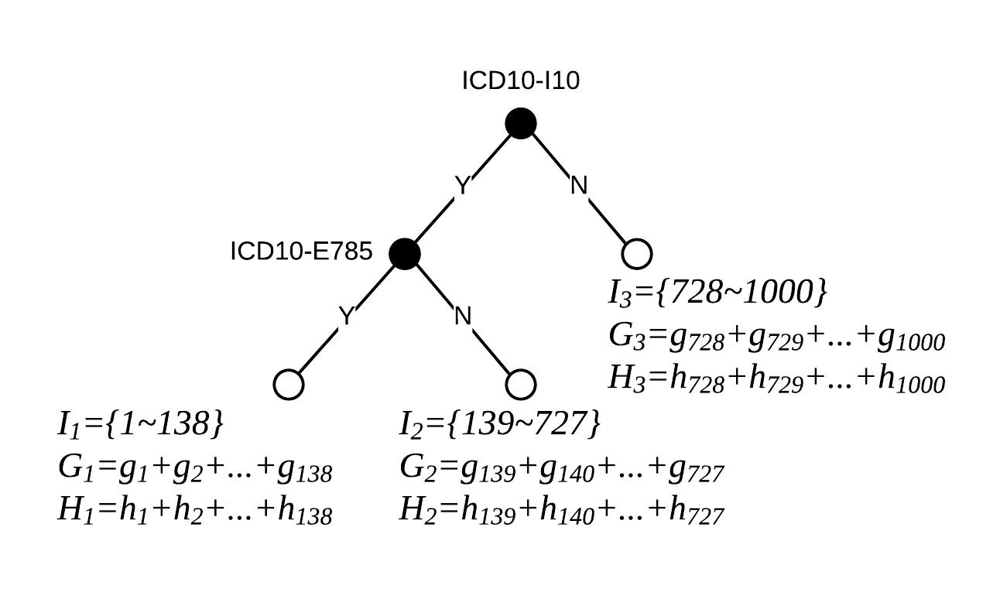
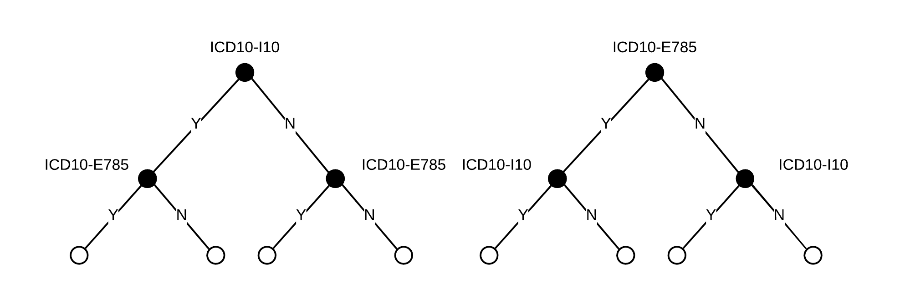

> With the birth of XGBoost, additive tree models have been widely applied in industries (such as LightGBM, CatBoost) due to their state-of-the-art performance and well-engineered parallel acceleration computing. However the one general rule in machine learning field is more complex models that fit well to data are less interpretable. This article will talk about different approaches that let a model "speaks" and explains how the model generate outputs.


{: class="table-of-content"}
* TOC
{:toc}


Interpretability of machine learning is vital important in any business applications, which is one of the biggest challenge of machine learning product selling. Most data scientists or machine learning engineers often do not focus on buying user trust by explaining reasoning behind a decision in an easy-to-digest way, but spend most of the time trying to boost model performance. I've encountered situations so many times that I presented some cool stuffs with confidence to leaderships how magic they are and how much money they're gonna save for the company, but I was followed by questions like "man this is great, but how does it come to such conclusions". It's tough, especially when trying to explain models to non-technical folks who are usually the guys deciding whether to apply your models. When you are trying to train cutting-edge algorithms, it equally increase the difficulty of model interpretation, because it is their decision-making complexity that fit the data better.


XGBoost by [Chen and Guestrin](https://arxiv.org/pdf/1603.02754.pdf) (as well as faster version LightGBM by [Ke et al.](https://papers.nips.cc/paper/6907-lightgbm-a-highly-efficient-gradient-boosting-decision-tree.pdf)) might be many companies' favorite algorithm. The performance usually the most robust and outstanding compared to traditional models, and they are easy to train and deploy in multiple environment. Let's break down some details about approaches to interpret these additive tree models.


## Start with an Example

Let's start with an simple example. We have couple of patients' claim data from last year and we want to prospective find out whether they will potentially have vascular disease next year. The dataset is rather straightforward: we have 8 claim codes as variables which are all binary values indicating each patient filed that claim last year. All of these codes are not directly indicating vascular disease in Medicare population based on [CMS' 2019 rules](https://www.cms.gov/Medicare/Health-Plans/MedicareAdvtgSpecRateStats/Risk-Adjustors-Items/RiskModel2019.html), in this way we actually machine learning meaning to detect those who might have potential gaps of vascular disease. And we have one column of binary labels indicating the fact whether patients were diagnosed as vascular disease last year. The 8 variables are:


|  Variable  |  Description |
| ------------ | ------------ |
| NDC-000030894 | Eliquis Apixaban (treat and prevent blood clots and to prevent stroke) | 
| CPT-93923 | Under Non-Invasive Extremity Arterial Studies, upper and lower |
| CPT-93306 | Under Echocardiography Procedures | 
| ICD10-E785 | Hyperlipidemia, unspecified |
| ICD10-I110 | Initial Nursing Facility Care, per day |
| CPT-93925 | Under Non-Invasive Extremity Arterial Studies, lower |
| ICD10-I10 | Essential (Primary) Hypertension |
| NDC-504580579 | Rivaroxaban, (blood thinners treating and preventing blood clots) |


Taking XGBoost as example, a simple model is built under Python 3.7 with XGBoost version as [0.90](https://xgboost.readthedocs.io/en/release_0.90/python/python_api.html#module-xgboost.sklearn). Let's build the model and plot XGBoost's native feature importance:

```python
import xgboost as xgb
import pandas as pd
import matplotlib.pyplot as plt

# read dataset
data = pd.read_csv('vd_example.csv', header=0)
columns = data.columns
print(columns)

# shuffle dataset
data = data.sample(frac=1).reset_index(drop=True)

# train xgboost model
param = {
    "learning_rate": 0.1,
    "n_estimators ": 500,
    "max_depth": 7,
    "min_child_weight": 1,
    "gamma": 0,
    "importance_type": "gain",
    "n_jobs": -1,
}
model = xgb.XGBClassifier(**param).fit(data[columns[:-1]], data['Vascular_Disease'].values)

# plot feature importance
with plt.style.context("ggplot"):
    plt.figure(figsize=(15, 5))
    plt.bar(range(len(columns[:-1])), model.feature_importances_)
    plt.xticks(range(len(columns[:-1])), columns[:-1], rotation=-45, fontsize=14)
    plt.title('Feature importance', fontsize=14)
    plt.show()
```
<br>
<div style="text-align: center"></div>

<center> <i>Fig. 1. Feature importance (Gain) in XGBClassifier</i> </center>


Is this plot telling the story? Can we say essential hypertension is the largest contributor to the output? Noticed that in the parameter set I added ```importance_type``` as ```"gain"```, there are also options of ```"weight"``` and ```"cover"```. What does that means? Is there any other metrics to interpret the model? Let's break down.


## Feature Importance from "Inside"

All of these 3 metrics are global feature importance built in XGBoost library, which measure the overall contribution of each feature in input $X$ to target variables $y$ based on how we utilize stats in tree-based weak learners.

### Weight (Frequency)

Additive tree models are massive ensemble of multiple weak learners, which in general are [CARTs (Classification And Regression Trees)](https://en.wikipedia.org/wiki/Decision_tree_learning). The weight (or frequency) measure of XGBoost is the percentage representing the numbers of times each feature occurs in the trees of the model or number of times each feature used for split. In the our example, let's assume the model only contains 3 trees as followed:

<div style="text-align: center"></div>

<center> <i>Fig. 2. Sample XGBoost Trees</i> </center>

The weight approach count the total splits for each feature: e.g. ICD10-I10 occurred in 1 split and 1 split in each of tree1 and tree3; then we the weight for ICD10-I10 will be 2. The frequency for ICD10-I10 is calculated as its percentage weight over weights of all features. In this 3-tree example, weights are ICD10-E785: 3 (0.375), ICD10-I10: 2 (0.25), CPT-93923: 1 (0.125), CPT-99305: 1 (0.125) and CPT-99306: 1 (0.125), while all other features got weights of 0.


The downside of weight approach is, the features that get more splits are not necessarily contribute more to the output. Common features might be used for splitting trees a lot, but those splits might not distinguish targets significantly. Another issue with weight approach is not stable from model to model under the same dataset: if you train 2 models on exactly the same dataset, the tree structures are totally different which affects split counts. Let's see how weight approach perform on our actual dataset:

<div style="text-align: center"></div>

<center> <i>Fig. 3. Feature importance (Weight) in XGBClassifier</i> </center>

Compared to gain above, the contributes from ICD10-E785 significantly increased, probably because it is used for tree split the most, but those splits do not significantly increase model scores: we can interpret it as there are many patients having hyperlipidemia; people with actual vascular disease most likely have hyperlipidemia but people having hyperlipidemia not necessarily encounter vascular disease.


### Cover

The cover approach consider contributions from data exemplar perspective. It calculates the relative number of observations (samples) related to this feature. In the above 3-tree example, if we have 1000 training samples in total, and suppose ICD10-E785 is used to decide the leaf node for 439, 842, and 901 observations in tree1, tree2 and tree3 respectively; then the metric will count cover for ICD10-E785 as $439 + 842 + 901 = 2182$ samples. This will be calculated for all the 8 features and the cover will be 2182 expressed as a percentage for all features' numbers. Similar to weights, cover metric is also very sensitive to training set and how the trees designed, which lead to inconsistent results. Let's see how cover perform on our example:

<div style="text-align: center"></div>

<center> <i>Fig. 4. Feature importance (Cover) in XGBClassifier</i> </center>

The distribution is more similar to Gain measurement. We noticed different metrics can be entirely different from one another.


### Gain

The gain approach provides a more native way to measure feature contribution. It implies the relative contribution of the corresponding feature to the model calculated by taking each feature's contribution for each tree in the model during entire training process. A higher value of this metric when compared to another feature implies it is more important for generating a prediction. To understand how to calculate the metrics, we need to start with [the principle of additive tree model](https://arxiv.org/pdf/1603.02754.pdf) taking XGBoost as example.

The essence of additive training is adding one tree-based weak learner at a time, and try to learn tree parameters and structure to minimize loss between prediction $\hat{y}$ and ground truth $y$. Let tree as function $f_t(x_i)$ as the function of leaf scores, we have:

$$
\begin{align}
\hat{y}_i^{(0)} &= 0\\
\hat{y}_i^{(1)} &= f_1(x_i) = \hat{y}_i^{(0)} + f_1(x_i)\\
\hat{y}_i^{(2)} &= f_1(x_i) + f_2(x_i)= \hat{y}_i^{(1)} + f_2(x_i)\\
&\dots\\
\hat{y}_i^{(t)} &= \sum_{k=1}^t f_k(x_i)= \hat{y}_i^{(t-1)} + f_t(x_i)
\end{align}
$$

Let $l$ as the loss of step $t$, $\Omega$ as [L2 regularization](https://medium.com/datadriveninvestor/l1-l2-regularization-7f1b4fe948f2) and $C$ as any constant value, we have the objective function $\mathcal{L}^{(t)}$ at each step of:

$$
\begin{align}
\text{min } \mathcal{L}^{(t)}
&= \sum_{i=1}^n l(y_i, \hat{y}_i^{(t)}) + \sum_{i=1}^t\Omega(f_i) \\
&= \sum_{i=1}^n l(y_i, \hat{y}_i^{(t-1)} + f_t(x_i)) + \Omega(f_t) + C
\end{align}
$$

Here comes the beauty of XGBoost is it utilizes [Maclaurin Series](http://mathworld.wolfram.com/MaclaurinSeries.html) (or [Taylor Expansion](http://mathworld.wolfram.com/TaylorSeries.html) when constant point $a=0$) to simplify $\mathcal{L}^{(t)}$: according to Maclaurin Series:

$$
F(x) = F(0)+F'(0)x+\frac{F''(0)}{2!}x^2+\frac{F^{(3)}(0)}{3!}x^3+ \dots +\frac{F^{(n)}(0)}{n!}x^n+ \dots
$$

where $n$ close to infinite large. At point $ f_t(x_i)=0$ and expand our loss function up to the second order ($n=2$):

$$
\begin{align}
\text{min } \mathcal{L}^{(t)}
&\approx \sum_{i=1}^n [ l(y_i, \hat{y}_i^{(t-1)}) + \frac{\mathcal{L^{(1)}}^{(t)} f_t(x_i)}{1!}  + \frac{\mathcal{L^{(2)}}^{(t)} f_t^2(x_i)}{2!} ]+ \Omega(f_t) + C\\
&= \sum_{i=1}^n [ l(y_i, \hat{y}_i^{(t-1)}) + g_i f_t(x_i) + \frac{1}{2}h_i f_t^2(x_i) ]+ \Omega(f_t) + C
\end{align}
$$

where $g_i$ and $h_i$ are:

$$
\begin{align}
g_i &= \partial_{\hat{y}_i^{(t-1)}} l(y_i, \hat{y}_i^{(t-1)})\\
h_i &= \partial_{\hat{y}_i^{(t-1)}}^2 l(y_i, \hat{y}_i^{(t-1)})
\end{align}
$$

after removing all constants, we got final loss function $\mathcal{L'}^{(t)}$ as:

$$
\text{min } \mathcal{L'}^{(t)} = \sum_{i=1}^n [g_i f_t(x_i) + \frac{1}{2} h_i f_t^2(x_i)] + \Omega(f_t)
$$

Now the objective function is totally dependent on the partial derivative from the last step instead of the form of loss function design, which enables users to custom any loss functions (cross entropy, mean square error etc.) The reason we expand function up to second order is to coordinate with regularization term. Let $w$ as the vector of leaf values of tree $f_t(x)$ and $T$ as the number of leaves, the L2 regularization would be:

$$
\Omega(f) = \gamma T + \frac{1}{2}\lambda \sum_{j=1}^T w_j^2
$$

where $\gamma$ is the user defined factor of punishing feature size. In this form, we can convert final loss function $\mathcal{L'}^{(t)}$ as:

$$
\begin{align}
\text{min } \mathcal{L'}^{(t)}
&= \sum_{i=1}^n [g_i w_{x_i} + \frac{1}{2} h_i w^2_{x_i}] + \gamma T + \frac{1}{2}\lambda \sum_{j=1}^T w_j^2\\
&= \sum^T_{j=1} [(\sum_{i\in I_j} g_i) w_j + \frac{1}{2} (\sum_{i\in I_j} h_i + \lambda) w_j^2 ] + \gamma T
\end{align}
$$

where $I_j$ is the set of indices of data samples assigned to the $j$-th leaf. Since all data samples on the same leaf share the same score, we can simplify the function by letting $G_j = \sum_{i\in I_j} g_i$ and $H_j = \sum_{i\in I_j} h_i$:

$$
\text{min } \mathcal{L'}^{(t)} = \sum^T_{j=1} [G_j w_j + \frac{1}{2} (H_j + \lambda) w_j^2 ] + \gamma T
$$

Now the loss function has been compressed to a perfect **quadratic** form (well-engineered!), hereby given a specific tree structure, we can easily calculate optimal $w^*_j$ as when:

$$
\begin{align}
\mathcal{L'^{(1)}}^{(t)} &= \sum^T_{j=1} [G_j +  (H_j + \lambda) w^*_j ] = 0\\
w_j^\ast &= -\frac{G_j}{H_j+\lambda}\\
\mathcal{L'}^{(t)*} &= -\frac{1}{2} \sum_{j=1}^T \frac{G_j^2}{H_j+\lambda} + \gamma T
\end{align}
$$

Taking the tree1 from above as an example, suppose the tree split the 1000-sample dataset as:


<div style="text-align: center"></div>

<center> <i>Fig. 5. How to measure score of a tree structure.</i> </center>

Given this tree, the optimal loss would be: $ \mathcal{L'}^* = - \sum_j \frac{G_j^2}{H_j+\lambda} + 3\gamma $

After all these XGBoost proposes a very fast, easy way to find the best leaf scores given a tree structure, but the other important part of each step is find the best structure, here comes the concept of **"gain"**. Given the above approach, additive tree models find the best tree structure by **enumerating all splits one level at a time**, rather than enumerating all possible trees due to intensive computing in practice. On each tree level, we compare the loss after best split of each features and the original loss, i.e. define gain as the subtraction of:

$$
\text{Gain} = \frac{1}{2} \left[ \frac{G_L^2}{H_L+\lambda}+\frac{G_R^2}{H_R+\lambda}-\frac{(G_L+G_R)^2}{H_L+H_R+\lambda} \right] - \gamma
$$

where $L$ and $R$ notation represent the corresponding values of left and right leafs if we perform this split. If after splitting the $\text{Gain}$ is negative or 0, we simply abandon this trial, otherwise we accept the split. This approach mimics the **pruning** mechanism in CART. Note that this is the other reason why XGBoost and other modern algorithm much efficient than traditional boosting: such enumerating process can be paralleled with multi-core CPU or GPU accelerating or even scalable distributed computing.

Finally back to Figure 1., the final gain value for each feature is the sum-up of all gains per split of that feature. Compared to previous two measures, the gain approach measures the feature contributions closer to training process and loss reduction instead of being pre-defined and arbitrary metrics. However, gain still cannot solve several problems in terms of model interpretation:

- **Polarity**: it cannot reveal the polarity of feature contribution: all the feature importance value are shown as percentages over all values (positive values), we cannot distinguish those features contribute negatively to targets.
- **Interactive effects**: all values are independently appear as individual feature contributions, it cannot tell us how multiple features interactively affects model. Moreover, if there are two features highly correlated, the final feature importance scores might be weaken by each other.
- **Individual level interpretation**: now we can only view the overall feature importance globally, but it might differs a lot in terms of individual level. If we train a model to predict whether a person has flu, although globally "fever" has higher score than "sneeze", but we might notice model still predict a high probability to a person who doesn't have fever but sneeze, which means individually sneeze is a strong indicator of flu as well.
- **Consistency**: gain measure still cannot ensure the consistency of interpretation. A simple example would be if we compare the following two trees, they are identical logically and deliver the same output. But if we calculate the gains for tree1: $\text{Gain}_{I10} = \frac{1}{2} \left[ \frac{(G_1+G_2)^2}{H_1+H_2+\lambda}+\frac{(G_3+G_4)^2}{H_3+H_4+\lambda} \right] - \gamma$ while $\text{Gain}_{E785} = \frac{1}{2} \left[ \frac{G_1^2}{H_1+\lambda}+\frac{G_2^2}{H_2+\lambda}-\frac{(G_1+G_2)^2}{H_1+H_2+\lambda} + \frac{G_3^2}{H_3+\lambda}+\frac{G_4^2}{H_4+\lambda}-\frac{(G_3+G_4)^2}{H_3+H_4+\lambda} \right] - 2\gamma$. Now if we get gain for tree2: $\text{Gain}_{I10} = \frac{1}{2} \left[ \frac{G_1^2}{H_1+\lambda}+\frac{G_3^2}{H_3+\lambda}-\frac{(G_1+G_3)^2}{H_1+H_3+\lambda} + \frac{G_2^2}{H_2+\lambda}+\frac{G_4^2}{H_4+\lambda}-\frac{(G_2+G_4)^2}{H_2+H_4+\lambda} \right] - 2\gamma$ while $\text{Gain}_{E785} = \frac{1}{2} \left[ \frac{(G_1+G_3)^2}{H_1+H_3+\lambda}+\frac{(G_2+G_4)^2}{H_2+H_4+\lambda} \right] - \gamma$. The gain value for the same feature from two tree is totally different from each other. As we discuss above, XGBoost learns the tree structure by enumerating feature level by level in a random order, therefore we cannot ensure the tree structures nor gain values to be consistent even if two model deliver the similar results. 

<div style="text-align: center"></div>

<center> <i>Fig. 6. Gain metric inconsistency from comparison of two trees.</i> </center>


## Feature Importance from "Outside"

There approaches to interpret model from another perspective by treating the predictive model as a black box. In other words, the following approaches are not specifically designed for additive tree models but ideally for all machine learning model at any complexity levels.

### Permutation Importance

Permutation feature importance measures the increase in the prediction error of the model after we permuted the feature’s values, which breaks the relationship between the feature and the true outcome.

5.5.1 Theory
The concept is really straightforward: We measure the importance of a feature by calculating the increase in the model’s prediction error after permuting the feature. A feature is “important” if shuffling its values increases the model error, because in this case the model relied on the feature for the prediction. A feature is “unimportant” if shuffling its values leaves the model error unchanged, because in this case the model ignored the feature for the prediction. The permutation feature importance measurement was introduced by Breiman (2001)35 for random forests. Based on this idea, Fisher, Rudin, and Dominici (2018)36 proposed a model-agnostic version of the feature importance and called it model reliance. They also introduced more advanced ideas about feature importance, for example a (model-specific) version that takes into account that many prediction models may predict the data well. Their paper is worth reading.


Hope this post helps explain stuffs!
