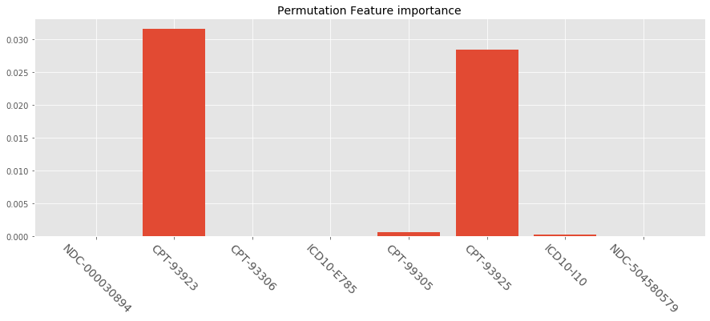
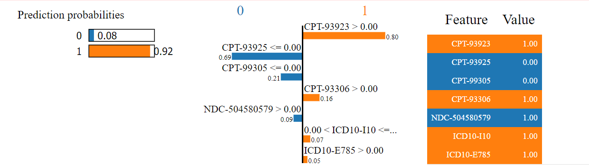

> With the birth of XGBoost, additive tree models have been widely applied in industries (such as LightGBM, CatBoost) due to their state-of-the-art performance and well-engineered parallel acceleration computing. However the one general rule in machine learning field is more complex models that fit well to data are less interpretable. This article will talk about different approaches that let a model "speaks" and explains how the model generate outputs.


{: class="table-of-content"}
* TOC
{:toc}


Interpretability of machine learning is vital important in any business applications, which is one of the biggest challenge of machine learning product selling as well. Most data scientists or machine learning engineers often do not focus on buying user trust by explaining reasoning behind a decision in an easy-to-digest way, but spend most of the time trying to boost model performance. I've encountered situations so many times that I presented some cool stuffs with confidence to leaderships how magic they are and how much money they're gonna save for the company, but I was followed by questions like "man this is great, but how does it come to such conclusions". It's tough, especially when trying to explain models to non-technical folks who are usually the guys deciding whether to apply your models. When you are trying to train cutting-edge algorithms, it equally increase the difficulty of model interpretation, because it is their decision-making complexity that fit the data better.


XGBoost by [Chen and Guestrin](https://arxiv.org/pdf/1603.02754.pdf) (as well as faster version LightGBM by [Ke et al.](https://papers.nips.cc/paper/6907-lightgbm-a-highly-efficient-gradient-boosting-decision-tree.pdf)) might be many companies' favorite algorithm. The performance usually the most robust and outstanding compared to traditional models, and they are easy to train and deploy in multiple environment. Let's break down some details about approaches to interpret these additive tree models.


## Start with an Example

Let's start with an simple example. We have couple of patients' claim data from last year and we want to prospective find out whether they will potentially have vascular disease next year. The dataset is rather straightforward: we have 8 claim codes as variables which are all binary values indicating each patient filed that claim last year. All of these codes are not directly indicating vascular disease in Medicare population based on [CMS' 2019 rules](https://www.cms.gov/Medicare/Health-Plans/MedicareAdvtgSpecRateStats/Risk-Adjustors-Items/RiskModel2019.html), in this way we actually machine learning meaning to detect those who might have potential gaps of vascular disease. And we have one column of binary labels indicating the fact whether patients were diagnosed as vascular disease last year. The 8 variables are:


|  Variable  |  Description |
| ------------ | ------------ |
| NDC-000030894 | Eliquis Apixaban (treat and prevent blood clots and to prevent stroke) | 
| CPT-93923 | Under Non-Invasive Extremity Arterial Studies, upper and lower |
| CPT-93306 | Under Echocardiography Procedures | 
| ICD10-E785 | Hyperlipidemia, unspecified |
| CPT-99305 | Initial Nursing Facility Care, per day |
| CPT-93925 | Under Non-Invasive Extremity Arterial Studies, lower |
| ICD10-I10 | Essential (Primary) Hypertension |
| NDC-504580579 | Rivaroxaban, (blood thinners treating and preventing blood clots) |


Taking XGBoost as example, a simple model is built under Python 3.7 with XGBoost version as [0.90](https://xgboost.readthedocs.io/en/release_0.90/python/python_api.html#module-xgboost.sklearn). Let's build the model and plot XGBoost's native feature importance:

```python
import xgboost as xgb
import pandas as pd
import matplotlib.pyplot as plt

# read dataset
data = pd.read_csv('vd_example.csv', header=0)
columns = data.columns
print(columns)

# shuffle dataset
data = data.sample(frac=1).reset_index(drop=True)

# train xgboost model
param = {
    "learning_rate": 0.1,
    "n_estimators ": 500,
    "max_depth": 7,
    "min_child_weight": 1,
    "gamma": 0,
    "importance_type": "gain",
    "n_jobs": -1,
}
model = xgb.XGBClassifier(**param).fit(data[columns[:-1]], data['Vascular_Disease'].values)

# plot feature importance
with plt.style.context("ggplot"):
    plt.figure(figsize=(15, 5))
    plt.bar(range(len(columns[:-1])), model.feature_importances_)
    plt.xticks(range(len(columns[:-1])), columns[:-1], rotation=-45, fontsize=14)
    plt.title('Feature importance', fontsize=14)
    plt.show()
```
<br>
<div style="text-align: center"></div>

<center> <i>Fig. 1. Feature importance (Gain) in XGBClassifier</i> </center>


Is this plot telling the story? Can we say essential hypertension is the largest contributor to the output? Noticed that in the parameter set I added ```importance_type``` as ```"gain"```, there are also options of ```"weight"``` and ```"cover"```. What does that means? Is there any other metrics to interpret the model? Let's break down.


## Feature Importance from "Inside"

All of these 3 metrics are global feature importance built in XGBoost library, which measure the overall contribution of each feature in input $X$ to target variables $y$ based on how we utilize stats in tree-based weak learners.

### Weight (Frequency)

Additive tree models are massive ensemble of multiple weak learners, which in general are [CARTs (Classification And Regression Trees)](https://en.wikipedia.org/wiki/Decision_tree_learning). The weight (or frequency) measure of XGBoost is the percentage representing the numbers of times each feature occurs in the trees of the model or number of times each feature used for split. In the our example, let's assume the model only contains 3 trees as followed:

<div style="text-align: center"></div>

<center> <i>Fig. 2. Sample XGBoost Trees</i> </center>

The weight approach count the total splits for each feature: e.g. ICD10-I10 occurred in 1 split and 1 split in each of tree1 and tree3; then we the weight for ICD10-I10 will be 2. The frequency for ICD10-I10 is calculated as its percentage weight over weights of all features. In this 3-tree example, weights are ICD10-E785: 3 (0.375), ICD10-I10: 2 (0.25), CPT-93923: 1 (0.125), CPT-99305: 1 (0.125) and CPT-99306: 1 (0.125), while all other features got weights of 0.


The downside of weight approach is, the features that get more splits are not necessarily contribute more to the output. Common features might be used for splitting trees a lot, but those splits might not distinguish targets significantly. Another issue with weight approach is not stable from model to model under the same dataset: if you train 2 models on exactly the same dataset, the tree structures are totally different which affects split counts. Let's see how weight approach perform on our actual dataset:

<div style="text-align: center"></div>

<center> <i>Fig. 3. Feature importance (Weight) in XGBClassifier</i> </center>

Compared to gain above, the contributes from ICD10-E785 significantly increased, probably because it is used for tree split the most, but those splits do not significantly increase model scores: we can interpret it as there are many patients having hyperlipidemia; people with actual vascular disease most likely have hyperlipidemia but people having hyperlipidemia not necessarily encounter vascular disease.


### Cover

The cover approach consider contributions from data exemplar perspective. It calculates the relative number of observations (samples) related to this feature. In the above 3-tree example, if we have 1000 training samples in total, and suppose ICD10-E785 is used to decide the leaf node for 439, 842, and 901 observations in tree1, tree2 and tree3 respectively; then the metric will count cover for ICD10-E785 as $439 + 842 + 901 = 2182$ samples. This will be calculated for all the 8 features and the cover will be 2182 expressed as a percentage for all features' numbers. Similar to weights, cover metric is also very sensitive to training set and how the trees designed, which lead to inconsistent results. Let's see how cover perform on our example:

<div style="text-align: center"></div>

<center> <i>Fig. 4. Feature importance (Cover) in XGBClassifier</i> </center>

The distribution is more similar to Gain measurement. We noticed different metrics can be entirely different from one another.


### Gain

The gain approach provides a more native way to measure feature contribution. It implies the relative contribution of the corresponding feature to the model calculated by taking each feature's contribution for each tree in the model during entire training process. A higher value of this metric when compared to another feature implies it is more important for generating a prediction. To understand how to calculate the metrics, we need to start with [the principle of additive tree model](https://arxiv.org/pdf/1603.02754.pdf) taking XGBoost as example.

The essence of additive training is adding one tree-based weak learner at a time, and try to learn tree parameters and structure to minimize loss between prediction $\hat{y}$ and ground truth $y$. Let tree as function $f_t(x_i)$ as the function of leaf scores, we have:

$$
\begin{align}
\hat{y}_i^{(0)} &= 0\\
\hat{y}_i^{(1)} &= f_1(x_i) = \hat{y}_i^{(0)} + f_1(x_i)\\
\hat{y}_i^{(2)} &= f_1(x_i) + f_2(x_i)= \hat{y}_i^{(1)} + f_2(x_i)\\
&\dots\\
\hat{y}_i^{(t)} &= \sum_{k=1}^t f_k(x_i)= \hat{y}_i^{(t-1)} + f_t(x_i)
\end{align}
$$

Let $l$ as the loss of step $t$, $\Omega$ as [L2 regularization](https://medium.com/datadriveninvestor/l1-l2-regularization-7f1b4fe948f2) and $C$ as any constant value, we have the objective function $\mathcal{L}^{(t)}$ at each step of:

$$
\begin{align}
\text{min } \mathcal{L}^{(t)}
&= \sum_{i=1}^n l(y_i, \hat{y}_i^{(t)}) + \sum_{i=1}^t\Omega(f_i) \\
&= \sum_{i=1}^n l(y_i, \hat{y}_i^{(t-1)} + f_t(x_i)) + \Omega(f_t) + C
\end{align}
$$

Here comes the beauty of XGBoost is it utilizes [Maclaurin Series](http://mathworld.wolfram.com/MaclaurinSeries.html) (or [Taylor Expansion](http://mathworld.wolfram.com/TaylorSeries.html) when constant point $a=0$) to simplify $\mathcal{L}^{(t)}$: according to Maclaurin Series:

$$
F(x) = F(0)+F'(0)x+\frac{F''(0)}{2!}x^2+\frac{F^{(3)}(0)}{3!}x^3+ \dots +\frac{F^{(n)}(0)}{n!}x^n+ \dots
$$

where $n$ close to infinite large. At point $ f_t(x_i)=0$ and expand our loss function up to the second order ($n=2$):

$$
\begin{align}
\text{min } \mathcal{L}^{(t)}
&\approx \sum_{i=1}^n [ l(y_i, \hat{y}_i^{(t-1)}) + \frac{\mathcal{L^{(1)}}^{(t)} f_t(x_i)}{1!}  + \frac{\mathcal{L^{(2)}}^{(t)} f_t^2(x_i)}{2!} ]+ \Omega(f_t) + C\\
&= \sum_{i=1}^n [ l(y_i, \hat{y}_i^{(t-1)}) + g_i f_t(x_i) + \frac{1}{2}h_i f_t^2(x_i) ]+ \Omega(f_t) + C
\end{align}
$$

where $g_i$ and $h_i$ are:

$$
\begin{align}
g_i &= \partial_{\hat{y}_i^{(t-1)}} l(y_i, \hat{y}_i^{(t-1)})\\
h_i &= \partial_{\hat{y}_i^{(t-1)}}^2 l(y_i, \hat{y}_i^{(t-1)})
\end{align}
$$

after removing all constants, we got final loss function $\mathcal{L'}^{(t)}$ as:

$$
\text{min } \mathcal{L'}^{(t)} = \sum_{i=1}^n [g_i f_t(x_i) + \frac{1}{2} h_i f_t^2(x_i)] + \Omega(f_t)
$$

Now the objective function is totally dependent on the partial derivative from the last step instead of the form of loss function design, which enables users to custom any loss functions (cross entropy, mean square error etc.) The reason we expand function up to second order is to coordinate with regularization term. Let $w$ as the vector of leaf values of tree $f_t(x)$ and $T$ as the number of leaves, the L2 regularization would be:

$$
\Omega(f) = \gamma T + \frac{1}{2}\lambda \sum_{j=1}^T w_j^2
$$

where $\gamma$ is the user defined factor of punishing feature size. In this form, we can convert final loss function $\mathcal{L'}^{(t)}$ as:

$$
\begin{align}
\text{min } \mathcal{L'}^{(t)}
&= \sum_{i=1}^n [g_i w_{x_i} + \frac{1}{2} h_i w^2_{x_i}] + \gamma T + \frac{1}{2}\lambda \sum_{j=1}^T w_j^2\\
&= \sum^T_{j=1} [(\sum_{i\in I_j} g_i) w_j + \frac{1}{2} (\sum_{i\in I_j} h_i + \lambda) w_j^2 ] + \gamma T
\end{align}
$$

where $I_j$ is the set of indices of data samples assigned to the $j$-th leaf. Since all data samples on the same leaf share the same score, we can simplify the function by letting $G_j = \sum_{i\in I_j} g_i$ and $H_j = \sum_{i\in I_j} h_i$:

$$
\text{min } \mathcal{L'}^{(t)} = \sum^T_{j=1} [G_j w_j + \frac{1}{2} (H_j + \lambda) w_j^2 ] + \gamma T
$$

Now the loss function has been compressed to a perfect **quadratic** form (well-engineered!), hereby given a specific tree structure, we can easily calculate optimal $w^*_j$ as when:

$$
\begin{align}
\mathcal{L'^{(1)}}^{(t)} &= \sum^T_{j=1} [G_j +  (H_j + \lambda) w^*_j ] = 0\\
w_j^\ast &= -\frac{G_j}{H_j+\lambda}\\
\mathcal{L'}^{(t)*} &= -\frac{1}{2} \sum_{j=1}^T \frac{G_j^2}{H_j+\lambda} + \gamma T
\end{align}
$$

Taking the tree1 from above as an example, suppose the tree split the 1000-sample dataset as:


<div style="text-align: center"></div>

<center> <i>Fig. 5. How to measure score of a tree structure.</i> </center>

Given this tree, the optimal loss would be: $ \mathcal{L'}^* = - \sum_j \frac{G_j^2}{H_j+\lambda} + 3\gamma $

After all these XGBoost proposes a very fast, easy way to find the best leaf scores given a tree structure, but the other important part of each step is find the best structure, here comes the concept of **"gain"**. Given the above approach, additive tree models find the best tree structure by **enumerating all splits one level at a time**, rather than enumerating all possible trees due to intensive computing in practice. On each tree level, we compare the loss after best split of each features and the original loss, i.e. define gain as the subtraction of:

$$
\text{Gain} = \frac{1}{2} \left[ \frac{G_L^2}{H_L+\lambda}+\frac{G_R^2}{H_R+\lambda}-\frac{(G_L+G_R)^2}{H_L+H_R+\lambda} \right] - \gamma
$$

where $L$ and $R$ notation represent the corresponding values of left and right leafs if we perform this split. If after splitting the $\text{Gain}$ is negative or 0, we simply abandon this trial, otherwise we accept the split. This approach mimics the **pruning** mechanism in CART. Note that this is the other reason why XGBoost and other modern algorithm much efficient than traditional boosting: such enumerating process can be paralleled with multi-core CPU or GPU accelerating or even scalable distributed computing.

Finally back to Figure 1., the final gain value for each feature is the sum-up of all gains per split of that feature. Compared to previous two measures, the gain approach measures the feature contributions closer to training process and loss reduction instead of being pre-defined and arbitrary metrics. However, gain still cannot solve several problems in terms of model interpretation:

- **Polarity**: it cannot reveal the polarity of feature contribution: all the feature importance value are shown as percentages over all values (positive values), we cannot distinguish those features contribute negatively to targets.
- **Interactive effects**: all values are independently appear as individual feature contributions, it cannot tell us how multiple features interactively affects model. Moreover, if there are two features highly correlated, the final feature importance scores might be weaken by each other.
- **Individual level interpretation**: now we can only view the overall feature importance globally, but it might differs a lot in terms of individual level. If we train a model to predict whether a person has flu, although globally "fever" has higher score than "sneeze", but we might notice model still predict a high probability to a person who doesn't have fever but sneeze, which means individually sneeze is a strong indicator of flu as well.
- **Consistency**: gain measure still cannot ensure the consistency of interpretation. A simple example would be if we compare the following two trees, they are identical logically and deliver the same output. But if we calculate the gains for tree1: $\text{Gain}_{I10} = \frac{1}{2} \left[ \frac{(G_1+G_2)^2}{H_1+H_2+\lambda}+\frac{(G_3+G_4)^2}{H_3+H_4+\lambda}-\frac{\sum_i G_i}{\sum_i H_i + \lambda} \right] - \gamma$ while $\text{Gain}_{E785} = \frac{1}{2} \left[ \frac{G_1^2}{H_1+\lambda}+\frac{G_2^2}{H_2+\lambda}-\frac{(G_1+G_2)^2}{H_1+H_2+\lambda} + \frac{G_3^2}{H_3+\lambda}+\frac{G_4^2}{H_4+\lambda}-\frac{(G_3+G_4)^2}{H_3+H_4+\lambda} \right] - 2\gamma$. Now if we get gain for tree2: $\text{Gain}_{I10} = \frac{1}{2} \left[ \frac{G_1^2}{H_1+\lambda}+\frac{G_3^2}{H_3+\lambda}-\frac{(G_1+G_3)^2}{H_1+H_3+\lambda} + \frac{G_2^2}{H_2+\lambda}+\frac{G_4^2}{H_4+\lambda}-\frac{(G_2+G_4)^2}{H_2+H_4+\lambda} \right] - 2\gamma$ while $\text{Gain}_{E785} = \frac{1}{2} \left[ \frac{(G_1+G_3)^2}{H_1+H_3+\lambda}+\frac{(G_2+G_4)^2}{H_2+H_4+\lambda}-\frac{\sum_i G_i}{\sum_i H_i + \lambda} \right] - \gamma$. The gain values for the same feature from two trees are totally different from each other. As we discuss above, XGBoost learns the tree structure by enumerating feature level by level in a random order, therefore we cannot ensure the tree structures nor gain values to be consistent even if two model deliver the similar results. 

<div style="text-align: center"></div>

<center> <i>Fig. 6. Gain metric inconsistency from comparison of two trees.</i> </center>


## Feature Importance from "Outside"

There approaches categorized as "model-agnostic interpretation" which interpret model from another perspective by treating the predictive model as a black box. In other words, the following approaches are not specifically designed for additive tree models but ideally for all machine learning model at any complexity levels.

### Permutation Importance

Permutation feature importance was introduced by Breiman [(2001)](https://www.stat.berkeley.edu/~breiman/randomforest2001.pdf) for random forest which measures the increase in the prediction error of the model after we "mess up" (permuted) the feature values, which breaks the relationship between the feature and the true outcome. The concept recognize a feature is "important" if shuffling its values increases the model error a lot; while feature is "unimportant" if shuffling its values leaves the model error barely unchanged, i.e. the model ignored the feature for the prediction. Based on this idea, Fisher et al. [(2018)](https://arxiv.org/pdf/1801.01489.pdf) proposed "model reliance", a model-agnostic version of the feature importance. They also introduced more advanced ideas about feature importance, for example a (model-specific) version that takes into account that many prediction models may predict the data well. Here's briefly how we calculate permutation feature importance:

- Let the original model error $\xi=\mathcal{L}(y,f(X))$ where $f(X)$ is the trained model
- For each feature $j \in \{1,2,\dots,k\}$ where $k$ is the total number of feaures, generate feature matrix $X^p_j$ bu permuting feature $j$ in matrix $X$ which breaks the association between feature J and target $y$.
- Estimate error $\xi^p=\mathcal{L}(y,f(X^p_j))$ can define feature importance for j as $s_j=\xi^p/\xi$ or $s_j=\xi^p-\xi$

Let try it on our example with Python library ```eli5```:

```python
from eli5.sklearn import PermutationImportance

perm = PermutationImportance(model, random_state=1).fit(
    data[columns[:-1]],
    data['Vascular_Disease'].values
)

# plot feature importance
with plt.style.context("ggplot"):
    plt.figure(figsize=(15, 5))
    plt.bar(range(len(columns[:-1])), perm.feature_importances_)
    plt.xticks(range(len(columns[:-1])), columns[:-1], rotation=-45, fontsize=14)
    plt.title('Permutation Feature importance', fontsize=14)
    plt.show()
```
<br>
<div style="text-align: center"></div>

<center> <i>Fig. 7. Permutation feature importance in XGBClassifier</i> </center>

The results are dramatically different than what we saw before: it give significantly higher scores to CPT-93923 and CPT-93925 than others (noted that these two variables are very correlated). Is it reliable? There are actually couple of drawbacks in permutation feature importance:

- **Training vs test data**: since permutation feature importance is linked to the error of the model, sometimes it's not what you need. Specially in training/test data splits, if the model overfits, permutation importance calculated on training set and test data would be different. 
- **Consistency**: when the permutation is repeated multiple times on one feature, the results might vary greatly. Of course repeating the permutation and averaging the importance measures over repetitions stabilizes the measure, but increases the time of computation.
- **Correlation bias**: permutation of features produces unreal data instances when two or more features are correlated. When they are positively correlated (like CPT-93923 and CPT-93925 in our example) and it shuffles one of the features, it create new instances that are unlikely or even physically impossible (e.g. a male who is pregnant), yet it use these new instances to measure the importance.


### LIME

LIME, short for **L**ocal **I**nterpretable **M**odel-agnostic **E**xplanations ([Ribeiro et al., 2016](https://arxiv.org/pdf/1602.04938.pdf)) is a very interesting and intuitive idea in which the authors propose an implementation of local surrogate models trained additionally to approximate the predictions of the underlying black box model. It aims to explain predictions of any model in an interpretable and faithful manner to human by learning an local model around the prediction. Theoretically, the surrogate model should present:

- **Interpretability**: it is supposed to provide qualitative insights between the input to the target for non-technical folks to easily understand.
- **Local fidelity**: as a trade-off to interpretability: e.g. a too simplified surrogate model might be easy to understand but it won't be relevant to the original model anymore. It should be at least locally faithful and replicate original model's behavior closely to instance being predicted.
- **Model agnostic**: as we discuss as the beginning of this chapter, it explains the model from outside perspective by treating it as a black box $f(x)$. The approach should ideally work out for models with any complexity.
- **Global perspective**: it should provide global interpretation beside local surrogate models bu building selecting a set of explanations to present human as the representative of the original model.

The LIME explanation formula is defined as:

$$
\xi(x) = \underset{g \in G}{\mathrm{argmin}}\text{ }\mathcal{L}(f,g,\pi_x)+\Omega(g)
$$

where
- $f$ is the original model;
- $g$ is an interpretable model to approximate $f$. Here to be specific, "interpretable" means a simple model with high interpretability like linear model (by looking at coefficient weights) or decision tree (by looking at split logics);
- $\pi_x$ is a vector of weights to aggregate all interpretable models $g$;
- $\Omega(g)$ is the complexity of $g$, it can be number of weights if $g$ is a linear model, or depth of tree if $g$ is a decision tree.

Let's see how to operate it specifically. LIME propose to decide which feature has more contribution to the output by perturbing the input instance, or randomly sampling instance features' presence or absence. The intuition of perturbing is that it's understandable by human. For example, in tabular data, how does the model perform after removing some features, or in image data, how does the model perform after covering some part of the image, or in text data, how does the model perform after removing some words. Let $x'$ as the binary vector of human understandable version of the actual features used by original model representing the presence/absence of each feature, while a set of $z' \in \{0,1\}^{d'}$ as the corresponding perturbed instance uniformly sample from $x'$ (nonzero fraction elements of $x'$). We use these new set $Z$ to probe the original model as black box as often as we want and try to train an interpretable model $g$. Let's take Spare Linear Explanation from the paper as example:

Let's assume $g(z')=w \cdot z'$ as a linear model, usually we use [Lasso](https://en.wikipedia.org/wiki/Lasso_(statistics)) (I'll explain later why). We will try to minimize $\mathcal{L}(f,g,\pi_x)$ using square loss:

$$
\mathcal{L}(f,g,\pi_x) = \underset{z,z' \in Z}{\sum} \pi_x(z) \left( f(z)-g(z')^2 \right)
$$

where $\pi_x(z)=\exp(-\frac{D(x,z)^2}{\sigma^2})$ as an exponential kernel. Remember $\pi_x$ should be representing the proximity between original model $f$ and surrogate model $g$ to weight all trials under $z'$, so we use $D(x,z)$ to be some distance function like [Euclidean distance](https://en.wikipedia.org/wiki/Euclidean_distance) or [cosine distance](https://en.wikipedia.org/wiki/Cosine_similarity) with width $\sigma$. We also set a constant number $K$ to limit the number of features to use: noticed $\Omega(g)$ disappears from the objective function, the reason is we hope to use $\Omega(g)$ penalty to make $g$ as simple as possible, here we can simply use K-Lasso to do that. In Lasso we can simply tune $\lambda$ to set some weights to **exact 0** (compared to [Ridge](https://en.wikipedia.org/wiki/Tikhonov_regularization) is able to drive weights near 0 but always non-zero, you can find mathematical explanation in details [here](https://www.quora.com/How-would-you-describe-the-difference-between-linear-regression-lasso-regression-and-ridge-regression)), hereby we can achieve constant K-feature model for each $g$. At last, with the around-sampled $z'$ which leads to the minimal loss, we retrieve weight $w^*$ from the corresponding optimal $g^*$.

Let's try an example:

```python
import lime
import lime.lime_tabular
import numpy as np

# Key parameters explained
# training_data: as the binary vectors - x'
# mode: model type, here is "classification"
# training_labels: groud truth y
# kernel_width: sigma of in pi distance weight, defaults to sqrt (number of columns) * 0.75
# feature_selection: feature selection method, can be "forward_selection", "lasso_path", "none" or "auto".
# discretizer='quartile'

explainer = lime.lime_tabular.LimeTabularExplainer(
    training_data =data[columns[:-1]].astype(int).values,
    mode='classification',
    training_labels=data['Vascular_Disease'].values,
    feature_names=columns[:-1],
    feature_selection='lasso_path',
)

def prob(x):
    if len(x.shape) == 1:
        df_x = pd.DataFrame(np.reshape(x, [1, -1]), columns=columns[:-1])
    else:
        df_x = pd.DataFrame(x, columns=columns[:-1])
    return model.predict_proba(df_x)

# asking for explanation for LIME model
# data_row: 1d numpy array as an instance
# predict_fn: prediction function returning probabilities of each class
# num_features: maximum number of features: K
# num_samples: size of the neighborhood to learn the linear model: number of z'
# distance_metric: the distance metric in pi, default to be "euclidean"

sample_instance = np.array([0, 1, 1, 1, 0, 0, 1, 1])
exp = explainer.explain_instance(
    data_row=sample_instance,
    predict_fn=prob,
    num_features=8,
    num_samples=5000,
)
exp.show_in_notebook(show_predicted_value=True, show_table=True)
```

<br>
<div style="text-align: center"></div>

<center> <i>Fig. 8. LIME Local Explainer for XGBClassifier</i> </center>

There are three parts to the explanation:
1. Left part gives the prediction probabilities for class 0 and class 1.
2. Middle part gives the most important features. As it is an example of binary class we are looking at 2 colors. Attributes having orange color support the class 1 and those with color blue support class 0. CPT-93925 <= 0 means when this feature's value satisfy this criteria it support class 0. Float point number on the horizontal bars represent the relative importance of these features.
3. Right part follows the same color coding as 1 and 2. It contains the actual values of for the top variables.

LIME has been a popular approach to interpret complex model, more often in deep learning studies, due to it's unique idea "thing out of the box". But it has some major limitations as well:

- **Explainer parameter tunning**： the correct definition of the "neighborhood" is broad when using LIME with tabular data. For each application you have to try different kernel settings and see for yourself if the explanations actually make sense.
- **Under-engineered implementation**: as the authors mentioned as well, a lot of works needed for further improvement. For example, sampling could be improved in the current implementation of LIME. Data points are sampled from a Gaussian distribution, ignoring the correlation between features, which leads to unrealistic data points as we discussed in permutation approach. Algorithm optimization is needed as well since it requires a lot of computing resources to explain every instance.
- **Consistency**: again it's a big problem. [Alvarez-Melis et al.](https://arxiv.org/pdf/1806.08049.pdf) showed that the explanations of two very similar instances varied greatly in a simulated setting. Also, if you repeat the sampling process, then the explanations that come out can be different especially working with high-dimensional dataset.


## SHAP: Interpretable Additive Approach

SHAP (**SH**apley **A**dditive ex**P**lanations) by [Lundberg and Lee (2016)](https://arxiv.org/pdf/1802.03888.pdf) is a method to explain additive tree model predictions both individually and globally. The goal of SHAP is to explain the prediction of an instance $x$ by computing the contribution of each feature to the prediction, measured by Shapley values from [coalitional game theory](https://en.wikipedia.org/wiki/Cooperative_game_theory).

### Shapley Values

The Shapley value is a solution concept in coalitional game theory, which is named in honor of [Lloyd Shapley, 1953](https://apps.dtic.mil/dtic/tr/fulltext/u2/604084.pdf). To each cooperative game the approach assigns a unique contribution (among the players) of a total surplus generated by the coalition of all players. Let's say we have an investor and an engineer, who can earn 3000 dollars on a project if they work together. The two of them are the essence of the project, i.e. the project won't continue if any of them is absence. Upon that, if they hire a worker they can earn 3000 dollars more, and if they hire one more worker, they would get additional 3000 dollars. If they hire a third worker they won't make any more profit. Question is together they can make 9000 bucks all together, how to fairly distribute the profit to each one of them?

Before we dig into Shapley value, we have to make 3 fairness assumption:

1. The profit is not relevant to player title but only to contributions;
2. All profit belongs to players;
3. If one player participate multiple tasks, the player should earn multiple shares based on contribution.

The coalitional game is defined as: the player group is a set N (of 4 players) and a function $v$ that maps subsets of players to the real numbers $\mathbb {R}$ representing the present value a subset, with $v(\emptyset )=0$, where $\emptyset$ denotes the empty set. The function $v$ is called a characteristic function.

The function {\displaystyle v}v has the following meaning: if S is a coalition of players, then v(S), called the worth of coalition S, describes the total expected sum of payoffs the members of {\displaystyle S}S can obtain by cooperation.

The Shapley value is one way to distribute the total gains to the players, assuming that they all collaborate. It is a "fair" distribution in the sense that it is the only distribution with certain desirable properties listed below. According to the Shapley value,[6] the amount that player i gets given in a coalitional game {\displaystyle (v,N)}(v,N) is


Hope this post helps explain stuffs!

http://sofasofa.io/tutorials/shap_xgboost/
https://apps.dtic.mil/dtic/tr/fulltext/u2/604084.pdf
https://towardsdatascience.com/one-feature-attribution-method-to-supposedly-rule-them-all-shapley-values-f3e04534983d
https://christophm.github.io/interpretable-ml-book/shapley.html
https://en.wikipedia.org/wiki/Shapley_value
https://kilem3.wordpress.com/2006/04/09/shapley-value-%E5%A6%82%E4%BD%95%E5%85%AC%E5%B9%B3%E7%9A%84%E5%88%86%E9%85%8D%E6%94%B6%E7%9B%8A/